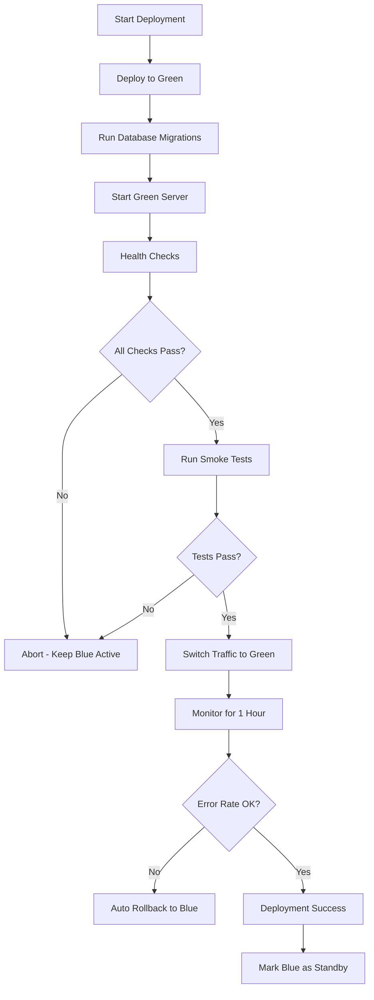

# WCAGAI Zero-Downtime Deployment Strategy

**Version:** 1.0.0
**Last Updated:** 2025-11-18
**Owner:** DevOps Team
**Status:** Production Ready

---

## Table of Contents

1. [Overview](#overview)
2. [Blue-Green Deployment Architecture](#blue-green-deployment-architecture)
3. [Database Migration Safety](#database-migration-safety)
4. [Health Check System](#health-check-system)
5. [Rollback Procedures](#rollback-procedures)
6. [Monitoring & Alerts](#monitoring--alerts)
7. [Deployment Runbook](#deployment-runbook)
8. [Incident Response](#incident-response)

---

## Overview

### Goals
- **Zero downtime** during deployments
- **Instant rollback** capability (< 30 seconds)
- **Automated safety checks** before traffic switching
- **Database migration safety** with backward compatibility
- **Real-time monitoring** with automatic rollback triggers

### Architecture Components
- **Blue Environment**: Current production traffic
- **Green Environment**: New deployment (testing phase)
- **Health Checks**: Comprehensive system validation
- **Traffic Router**: Instant switching between blue/green
- **Rollback System**: Automated and manual triggers

---

## Blue-Green Deployment Architecture

### Environment Setup

#### Railway Configuration

**Blue Environment (Production Active)**
```bash
# Railway Project: wcagai-production-blue
Environment Name: production-blue
Domain: wcagai-blue.railway.app
Database: PostgreSQL (shared with green)
Redis: Upstash Redis (shared with green)
```

**Green Environment (Staging/Inactive)**
```bash
# Railway Project: wcagai-production-green
Environment Name: production-green
Domain: wcagai-green.railway.app
Database: PostgreSQL (shared with blue)
Redis: Upstash Redis (shared with blue)
```

**Traffic Router**
```bash
# Primary Domain: wcagai.com
# Points to: Blue or Green based on deployment state
# DNS TTL: 60 seconds (for fast switching)
```

### Deployment Flow



### Traffic Switching Process

**Step 1: Pre-Switch Validation**
```bash
# Verify green environment health
curl https://wcagai-green.railway.app/health/ready
# Expected: {"status": "ready", "checks": {...}}

# Run smoke tests
npm run test:smoke -- --target=green

# Check error rate (should be 0%)
curl https://wcagai-green.railway.app/health/metrics
```

**Step 2: DNS Switch**
```bash
# Update DNS record
railway domains add wcagai.com --environment production-green

# Wait for propagation (60 seconds max)
watch -n 5 'dig wcagai.com +short'
```

**Step 3: Monitor**
```bash
# Watch error rate for 1 hour
railway logs --environment production-green --follow | grep ERROR

# Check metrics dashboard
open https://wcagai.com/admin/metrics
```

---

## Database Migration Safety

### Migration Rules

**GOLDEN RULE: All migrations MUST be backward compatible**

✅ **Safe Migrations:**
- Adding new tables
- Adding new columns (with defaults)
- Adding indexes (CREATE INDEX CONCURRENTLY)
- Adding constraints (NOT VALID, then validate separately)
- Creating new views

❌ **Unsafe Migrations:**
- Dropping columns (use 2-step deprecation)
- Renaming columns (use 2-step: add new, migrate data, drop old)
- Changing column types
- Adding NOT NULL constraints without defaults

### Migration Process

**Phase 1: Backward Compatible Schema Change**
```sql
-- Example: Adding new column
-- Migration: 20251118_add_compliance_score.sql

ALTER TABLE scans
ADD COLUMN compliance_score INTEGER DEFAULT NULL;

COMMENT ON COLUMN scans.compliance_score IS
'WCAG compliance score (0-100). Added 2025-11-18. Old code ignores this field.';
```

**Phase 2: Deploy Code That Uses New Column**
```typescript
// New code can read/write compliance_score
// Old code (blue environment) ignores it
const scan = await db.scans.create({
  url: req.body.url,
  compliance_score: calculateScore(violations) // Optional field
});
```

**Phase 3: Backfill Data (After Traffic Switch)**
```sql
-- Migration: 20251119_backfill_compliance_scores.sql
UPDATE scans
SET compliance_score = calculate_compliance_score(violations)
WHERE compliance_score IS NULL
  AND created_at > NOW() - INTERVAL '30 days';
```

### Migration Execution Order

```bash
# 1. Run migrations on GREEN environment (BEFORE code deploy)
railway run --environment production-green npm run db:migrate

# 2. Verify migration success
railway run --environment production-green npm run db:verify

# 3. Deploy new code to GREEN
railway up --environment production-green

# 4. Run integration tests
npm run test:integration -- --target=green

# 5. Switch traffic to GREEN
railway domains add wcagai.com --environment production-green

# 6. Keep BLUE warm for 24 hours (rollback capability)
# Do NOT stop blue environment yet

# 7. After 24h, run cleanup migrations if needed
railway run --environment production-blue npm run db:migrate
```

### Rollback Strategy for Migrations

**Scenario 1: Migration Fails**
```bash
# Migration failed on green
# Action: Abort deployment, keep blue active
railway logs --environment production-green | grep "ERROR"
# Fix migration, redeploy to green
```

**Scenario 2: Post-Deploy Issues**
```bash
# Issue discovered after traffic switch
# Action: Switch traffic back to blue (instant)
railway domains add wcagai.com --environment production-blue

# Rollback migration (if needed)
railway run --environment production-green npm run db:rollback
```

---

## Health Check System

### Endpoint Specifications

#### `/health` - Comprehensive Health Check
```typescript
// GET /health
// Response Time: < 100ms
// Used by: Monitoring dashboard, manual checks

{
  "status": "healthy" | "degraded" | "unhealthy",
  "timestamp": "2025-11-18T10:00:00.000Z",
  "version": "1.2.3",
  "environment": "production-green",
  "uptime_seconds": 3600,
  "checks": {
    "database": {
      "status": "up",
      "latency_ms": 15,
      "connections": {
        "active": 5,
        "idle": 10,
        "max": 20
      }
    },
    "redis": {
      "status": "up",
      "latency_ms": 3,
      "memory_used_mb": 42
    },
    "gemini_ai": {
      "status": "up",
      "latency_ms": 120,
      "api_key_valid": true,
      "rate_limit_remaining": 980
    },
    "serpapi": {
      "status": "up",
      "latency_ms": 85,
      "api_key_valid": true,
      "credits_remaining": 4500
    },
    "email_service": {
      "status": "up",
      "provider": "resend",
      "api_key_valid": true
    }
  },
  "metrics": {
    "requests_per_minute": 150,
    "avg_response_time_ms": 85,
    "error_rate": 0.002,
    "cpu_usage_percent": 45,
    "memory_usage_percent": 62
  }
}
```

**Status Determination:**
- `healthy`: All checks passing
- `degraded`: 1-2 non-critical services down (email, redis)
- `unhealthy`: Database down OR Gemini AI down

#### `/health/ready` - Readiness Probe
```typescript
// GET /health/ready
// Response Time: < 50ms
// Used by: Load balancer, Railway health checks

{
  "ready": true,
  "timestamp": "2025-11-18T10:00:00.000Z"
}
```

**Readiness Criteria:**
- Database connection established
- Gemini AI API key validated
- Server started successfully
- No ongoing migrations

#### `/health/live` - Liveness Probe
```typescript
// GET /health/live
// Response Time: < 10ms
// Used by: Railway container health checks

{
  "alive": true,
  "timestamp": "2025-11-18T10:00:00.000Z"
}
```

**Liveness Criteria:**
- Process is running
- Event loop not blocked
- No uncaught exceptions in last 60s

### Health Check Implementation

See: `backend/routes/health.js` for full implementation

### Automated Smoke Tests

**Post-Deployment Smoke Test Suite**
```bash
# Run smoke tests against green environment
npm run test:smoke -- --target=https://wcagai-green.railway.app

# Tests (must complete in < 60 seconds):
✓ Health check returns 200 OK
✓ Database connection successful
✓ Gemini AI accessible
✓ Create test scan (with real URL)
✓ Retrieve scan results
✓ Generate WCAG report
✓ Send test email notification
✓ API authentication works
✓ Rate limiting functional
✓ Security gates block malicious input

# Exit codes:
# 0 = All tests passed (proceed with traffic switch)
# 1 = Tests failed (abort deployment)
```

---

## Rollback Procedures

### Instant Traffic Rollback (< 30 seconds)

**Manual Rollback**
```bash
# scripts/rollback/instant-rollback.sh

#!/bin/bash
set -e

echo "🔴 INITIATING EMERGENCY ROLLBACK"
echo "Switching traffic from GREEN back to BLUE..."

# Switch DNS back to blue
railway domains add wcagai.com --environment production-blue

# Wait for DNS propagation
echo "Waiting 30s for DNS propagation..."
sleep 30

# Verify blue is serving traffic
curl -f https://wcagai.com/health || {
  echo "❌ ROLLBACK FAILED - Blue environment not responding"
  exit 1
}

echo "✅ ROLLBACK COMPLETE - Traffic now on BLUE"
echo "Next steps:"
echo "1. Investigate green environment issues"
echo "2. Review logs: railway logs --environment production-green"
echo "3. Fix issues and redeploy"
```

**Automated Rollback Triggers**
```typescript
// monitoring/auto-rollback.ts

const rollbackTriggers = {
  // Error rate threshold
  errorRate: {
    threshold: 0.05, // 5%
    duration: '5m',
    action: 'rollback',
    alert: 'critical'
  },

  // Response time threshold
  responseTime: {
    p95: 500, // ms
    duration: '10m',
    action: 'rollback',
    alert: 'critical'
  },

  // Health check failures
  healthCheckFailures: {
    count: 10,
    duration: '2m',
    action: 'rollback',
    alert: 'critical'
  },

  // AI service failures
  aiServiceFailures: {
    threshold: 0.20, // 20%
    duration: '5m',
    action: 'rollback',
    alert: 'warning'
  }
};

// Monitor and auto-rollback
async function monitorDeployment() {
  const metrics = await fetchMetrics();

  if (metrics.errorRate > rollbackTriggers.errorRate.threshold) {
    await executeRollback('High error rate detected');
  }

  if (metrics.p95ResponseTime > rollbackTriggers.responseTime.p95) {
    await executeRollback('Response time degradation');
  }

  // ... other checks
}
```

### Database Rollback

**Backward Compatible Rollback**
```bash
# scripts/rollback/database-rollback.sh

#!/bin/bash
set -e

echo "🗄️  DATABASE ROLLBACK"
echo "This will rollback the last migration"

# Show current migration version
railway run --environment production-green npm run db:version

# Rollback last migration
railway run --environment production-green npm run db:rollback

# Verify rollback
railway run --environment production-green npm run db:verify

echo "✅ Database rollback complete"
```

**Rollback to Specific Version**
```bash
# Rollback to specific migration
npm run db:rollback -- --to=20251118_v1.2.2

# Verify database state
npm run db:verify
```

### Feature Flag Rollback

**Kill Switch for New Features**
```bash
# scripts/rollback/feature-flag-disable.sh

#!/bin/bash

# Disable specific feature flag
railway variables set FEATURE_WCAG_AI_ENHANCED=false --environment production-green

# Restart service
railway restart --environment production-green

echo "✅ Feature flag disabled, service restarted"
```

---

## Monitoring & Alerts

### Error Rate Tracking

**Sentry Integration**
```typescript
// monitoring/sentry.ts

import * as Sentry from '@sentry/node';

Sentry.init({
  dsn: process.env.SENTRY_DSN,
  environment: process.env.RAILWAY_ENVIRONMENT,
  tracesSampleRate: 0.1, // 10% of transactions

  beforeSend(event, hint) {
    // Filter out non-critical errors
    if (event.level === 'warning') return null;
    return event;
  }
});

// Alert thresholds
const ERROR_RATE_WARNING = 0.01; // 1%
const ERROR_RATE_CRITICAL = 0.05; // 5%

// Monitor error rate
setInterval(async () => {
  const errorRate = await getErrorRate();

  if (errorRate > ERROR_RATE_CRITICAL) {
    await triggerRollback('Critical error rate');
    await sendPagerDutyAlert('CRITICAL: Error rate exceeded 5%');
  } else if (errorRate > ERROR_RATE_WARNING) {
    await sendSlackAlert('WARNING: Error rate exceeded 1%');
  }
}, 60000); // Check every minute
```

### Performance Monitoring

**Response Time Baselines**
```typescript
// monitoring/performance.ts

const BASELINES = {
  p50_response_time: 50,  // ms
  p95_response_time: 200, // ms
  p99_response_time: 500  // ms
};

const ALERT_THRESHOLDS = {
  p95_response_time: 300, // ms (warning)
  p95_critical: 500       // ms (rollback)
};

// Monitor performance
async function monitorPerformance() {
  const metrics = await getMetrics();

  if (metrics.p95 > ALERT_THRESHOLDS.p95_critical) {
    await triggerRollback('Performance degradation detected');
  } else if (metrics.p95 > ALERT_THRESHOLDS.p95_response_time) {
    await sendAlert('Performance degradation warning');
  }
}
```

### Automatic Rollback System

**Rollback Decision Engine**
```typescript
// monitoring/rollback-engine.ts

interface RollbackTrigger {
  name: string;
  condition: () => Promise<boolean>;
  severity: 'warning' | 'critical';
  action: 'alert' | 'rollback';
}

const triggers: RollbackTrigger[] = [
  {
    name: 'High Error Rate',
    condition: async () => (await getErrorRate()) > 0.05,
    severity: 'critical',
    action: 'rollback'
  },
  {
    name: 'Slow Response Time',
    condition: async () => (await getP95ResponseTime()) > 500,
    severity: 'critical',
    action: 'rollback'
  },
  {
    name: 'Health Check Failures',
    condition: async () => (await getHealthCheckFailures()) > 10,
    severity: 'critical',
    action: 'rollback'
  },
  {
    name: 'AI Service Degradation',
    condition: async () => (await getAIServiceFailureRate()) > 0.20,
    severity: 'warning',
    action: 'alert'
  }
];

// Run every minute
setInterval(async () => {
  for (const trigger of triggers) {
    if (await trigger.condition()) {
      if (trigger.action === 'rollback') {
        await executeRollback(trigger.name);
        await sendCriticalAlert(trigger.name);
      } else {
        await sendWarningAlert(trigger.name);
      }
    }
  }
}, 60000);
```

---

## Deployment Runbook

### Pre-Deployment Checklist

**24 Hours Before Deployment**
- [ ] Review release notes and changelog
- [ ] Verify all tests passing in staging
- [ ] Database migrations reviewed and approved
- [ ] Rollback plan documented
- [ ] On-call rotation confirmed
- [ ] Stakeholders notified of deployment window

**1 Hour Before Deployment**
- [ ] Run smoke tests in staging
- [ ] Verify blue environment healthy
- [ ] Confirm green environment provisioned
- [ ] Database backups completed
- [ ] Monitoring alerts configured
- [ ] Rollback scripts tested

### Deployment Execution

**Step 1: Deploy to Green (T-30min)**
```bash
# Deploy code to green environment
git checkout main
git pull origin main
railway up --environment production-green --detach

# Monitor deployment
railway logs --environment production-green --follow
```

**Step 2: Run Migrations (T-25min)**
```bash
# Execute migrations
railway run --environment production-green npm run db:migrate

# Verify migration success
railway run --environment production-green npm run db:verify
```

**Step 3: Health Checks (T-20min)**
```bash
# Wait for server to start
sleep 30

# Comprehensive health check
curl -f https://wcagai-green.railway.app/health | jq

# Verify all checks passing
curl -f https://wcagai-green.railway.app/health/ready | jq
```

**Step 4: Smoke Tests (T-15min)**
```bash
# Run automated smoke tests
npm run test:smoke -- --target=https://wcagai-green.railway.app

# Expected output: All tests passed (10/10)
```

**Step 5: Traffic Switch (T-10min)**
```bash
# Switch DNS to green
railway domains add wcagai.com --environment production-green

# Monitor DNS propagation
watch -n 5 'dig wcagai.com +short'
```

**Step 6: Monitor (T-0 to T+60min)**
```bash
# Watch logs for errors
railway logs --environment production-green --follow | grep -E "ERROR|FATAL"

# Monitor error rate dashboard
open https://wcagai.com/admin/metrics

# Check Sentry for new errors
open https://sentry.io/wcagai/

# Monitor response times
curl https://wcagai.com/health/metrics | jq .metrics.avg_response_time_ms
```

**Step 7: Validation (T+60min)**
- [ ] Error rate < 1%
- [ ] P95 response time < 200ms
- [ ] No critical alerts
- [ ] Health checks passing
- [ ] User reports normal

**Step 8: Cleanup (T+24h)**
```bash
# After 24 hours of stable green deployment
# Mark blue as inactive
railway environment delete production-blue

# Or keep for next blue-green cycle
```

### Post-Deployment Validation

**Metrics to Check:**
1. Error rate < 1% for 1 hour
2. P95 response time < 200ms
3. Health checks: 100% passing
4. AI service latency < 150ms
5. Database query time < 50ms
6. Zero rollbacks triggered

---

## Incident Response

### Scenario 1: High Error Rate Detected

**Alert:** Error rate exceeded 5% for 5 minutes

**Immediate Actions:**
```bash
# 1. Check current error rate
curl https://wcagai.com/health/metrics | jq .metrics.error_rate

# 2. Review recent errors
railway logs --environment production-green | grep ERROR | tail -50

# 3. If critical: Execute immediate rollback
./scripts/rollback/instant-rollback.sh

# 4. Investigate root cause
railway logs --environment production-green --since 1h > error-log.txt
```

### Scenario 2: Database Migration Failed

**Alert:** Migration execution failed on green

**Immediate Actions:**
```bash
# 1. DO NOT switch traffic to green
# Keep blue active

# 2. Review migration error
railway logs --environment production-green | grep "migration"

# 3. Rollback failed migration
railway run --environment production-green npm run db:rollback

# 4. Fix migration script

# 5. Redeploy to green
railway up --environment production-green
```

### Scenario 3: AI Service Degradation

**Alert:** Gemini AI failure rate > 20%

**Immediate Actions:**
```bash
# 1. Check feature flag
railway variables get FEATURE_WCAG_AI_ENHANCED --environment production-green

# 2. Disable AI features temporarily
./scripts/rollback/feature-flag-disable.sh

# 3. Verify fallback working
curl -X POST https://wcagai.com/api/scan/url -d '{"url":"https://example.com"}'

# 4. Monitor recovery
```

### Scenario 4: Performance Degradation

**Alert:** P95 response time > 500ms for 10 minutes

**Immediate Actions:**
```bash
# 1. Check current performance
curl https://wcagai.com/health/metrics | jq .metrics

# 2. Review slow queries
railway run --environment production-green npm run db:slow-queries

# 3. If critical: Rollback
./scripts/rollback/instant-rollback.sh

# 4. Investigate (after rollback)
# - Database connection pool exhaustion?
# - Memory leak?
# - External API slowness?
```

---

## Validation Criteria

### Before Production Launch

**Requirement: Deploy to staging 3x without downtime**

**Test 1: Normal Deployment**
- Deploy to staging-green
- Run migrations
- Switch traffic
- Monitor for 1 hour
- Success criteria: Zero errors, all health checks passing

**Test 2: Rollback Test**
- Deploy to staging-green
- Switch traffic
- Manually trigger rollback after 15 minutes
- Success criteria: Rollback completes in < 30s, zero user impact

**Test 3: Failure Scenario**
- Deploy intentionally broken code to staging-green
- Verify automated rollback triggers
- Success criteria: Auto-rollback within 5 minutes, zero downtime

---

## Appendix

### Railway Environment Variables

**Required for Both Environments:**
```bash
# Application
NODE_ENV=production
PORT=3000

# API Keys
GEMINI_API_KEY=<secret>
SERPAPI_KEY=<secret>

# Database (shared between blue/green)
DATABASE_URL=<railway-postgres-url>

# Redis (shared between blue/green)
REDIS_URL=<upstash-redis-url>

# Monitoring
SENTRY_DSN=<sentry-dsn>

# Feature Flags
FEATURE_WCAG_AI_ENHANCED=true
FEATURE_AUTO_ROLLBACK=true
```

### Useful Commands

```bash
# Check current active environment
dig wcagai.com +short

# View logs from both environments
railway logs --environment production-blue &
railway logs --environment production-green &

# Compare environment variables
railway variables --environment production-blue > blue-vars.txt
railway variables --environment production-green > green-vars.txt
diff blue-vars.txt green-vars.txt

# Database migrations
npm run db:migrate          # Run migrations
npm run db:rollback         # Rollback last migration
npm run db:version          # Show current version
npm run db:verify           # Verify database integrity

# Health checks
curl https://wcagai.com/health | jq
curl https://wcagai.com/health/ready | jq
curl https://wcagai.com/health/live | jq
curl https://wcagai.com/health/metrics | jq
```

---

## Contact & Support

**On-Call Rotation:**
- Week 1: DevOps Team
- Week 2: Backend Team
- Escalation: CTO

**Emergency Contacts:**
- Slack: #wcagai-alerts
- PagerDuty: WCAGAI Production
- Email: oncall@wcagai.com

**Documentation:**
- Runbooks: `/docs/runbooks/`
- Architecture: `/docs/ARCHITECTURE.md`
- API Docs: `https://wcagai.com/api/docs`

---

**END OF DEPLOYMENT STRATEGY DOCUMENT**
